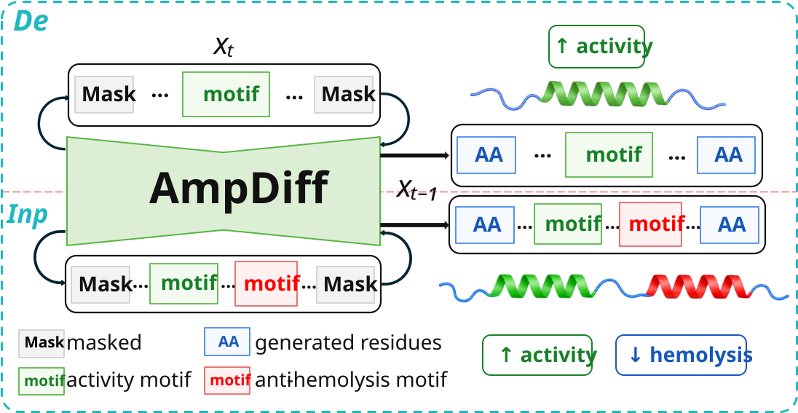

# HuDiff_Reuse
**HuDiff_Reuse** is the companion repository for our Reusability Report on **HuDiff**, an adaptive autoregressive diffusion framework for antibody and nanobody humanization. Rather than serving solely as a reimplementation of the original method, this repository provides the computational evidence supporting a systematic evaluation of HuDiff's reusability.

The study is organized into three complementary stages:

1. **Reproduction**  
   Reproduce representative results reported in the original HuDiff study under documented computational environments and evaluation protocols, establishing a reliable reference baseline for subsequent analyses.

2. **Robustness**  
   Stress-test HuDiff under variations in sampling conditions, input characteristics, and application settings to examine the stability of its reported performance and identify practical limitations that may emerge beyond the standard benchmark setting.

3. **Generalization**  
   Evaluate whether the HuDiff architecture can be reused beyond its original antibody-humanization setting. In particular, we migrate the HuDiff-Nb framework to antimicrobial peptide generation, resulting in **AmpDiff**, to investigate the extent to which the core diffusion architecture can support a biologically distinct sequence-design task.

The repository contains the code, experimental configurations, evaluation pipelines, and analysis scripts used to support the corresponding results and figures in the Reusability Report.


## Contents
- [Experimental Setup](#experimental-setup)
- [System Requirements](#system-requirements)
- [Reproduction](#reproduction)
- [Robustness](#robustness)
- [Generalizability](#generalizability)
- [Citation](#citation)


## Experimental Setup

All experiments were run on Linux servers with NVIDIA A100 GPUs. The robustness and generalizability sampling scripts use the following grid unless otherwise specified:
- Random seeds: `2024`, `2025`, `2026`
- Sampling temperatures: `0.6`, `1.0`, `1.4`
Outputs are written to `results/Robustness/` for antibody/nanobody robustness experiments and `results/Generalizability/` for AMP experiments.

## System Requirements
The codebase was developed with Python 3.9, PyTorch 1.13.0, and CUDA 11.6. Create the conda environment with:
```bash
conda env create -f environment.yaml -n HuDiff_Reuse
conda activate HuDiff_Reuse
```
The environment file installs the main conda and pip dependencies.

Install the AMP external predictors alongside `HuDiff_Reuse`.:
```text
<workspace>/
  HuDiff_Reuse/
  PepNet/
  AMPpred-MFA/
  iAMP-Attenpred/
  UniDL4BioPep/
  hemopi2/
```
Predictor links:
- [PepNet](https://github.com/Harkool/PepNet)
- [AMPpred-MFA](https://github.com/Jiangle525/AMPpred-MFA)
- [iAMP-Attenpred](https://github.com/xingwxzz/iAMP-Attenpred)
- [UniDL4BioPep](https://github.com/dzjxzyd/UniDL4BioPep)
- [HemoPI2](https://github.com/raghavagps/hemopi2)

The robustness evaluation stack may also require HuDiff-related tools such as AbNatiV, BioPhi/OASis, ABLSTM, ANARCI, and `abnumber`.

## Reproduction

Use the official [TencentAI4S/HuDiff](https://github.com/TencentAI4S/HuDiff) / [cloud77/HuDiff](https://huggingface.co/cloud77/HuDiff) repository to reproduce the original HuDiff antibody and nanobody humanization experiments. For consistency with this reuse study, run sampling with the three random seeds `2024`, `2025`, `2026` and the three temperatures `0.6`, `1.0`, `1.4`.

This repository does not replace the official HuDiff reproduction package. It uses HuDiff as the source framework and organizes the additional reuse experiments into the `Robustness` and `Generalizability` modules below.

## Robustness
Resources:

- [Robustness raw data](https://huggingface.co/cloud77/HuDiff)
- [Robustness raw data README](dataset/Robustness/raw_data/README.md)
- [Robustness checkpoints](https://huggingface.co/cloud77/HuDiff)
- [Robustness checkpoint README](checkpoints/Robustness/README.md)

Raw-data retraining path:

1. Download [Robustness raw data](https://huggingface.co/cloud77/HuDiff) and place the release-data files under `dataset/Robustness/raw_data/`.
2. Train and finetune the HuDiff robustness models:

```bash
bash scripts/Robustness/antibody/train.sh
bash scripts/Robustness/antibody/finetune.sh
bash scripts/Robustness/nanobody/train.sh
bash scripts/Robustness/nanobody/finetune.sh
```

Warm-start path:

1. Download [Robustness checkpoints](https://huggingface.co/cloud77/HuDiff).
2. Place the checkpoint files under `checkpoints/Robustness/`.

After either path, run antibody robustness sampling and evaluation with three seeds and three temperatures:

```bash
bash scripts/Robustness/antibody/sample_3seed_3temp.sh chicken
bash scripts/Robustness/antibody/eval_3seed_3temp.sh chicken
```

Supported antibody datasets are `chicken`, `rabbit`, `BH1`, and `Emicizumab`.

Run nanobody or heavy-chain robustness sampling and evaluation with the same seed-temperature grid:

```bash
bash scripts/Robustness/nanobody/sample_3seed_3temp.sh shark349
bash scripts/Robustness/nanobody/eval_3seed_3temp.sh shark349
```

Supported nanobody/heavy-chain datasets include `shark349`, `HuAb348_H`, and `Humab25_H`.

Robustness benchmark inputs are stored under `data/Robustness/`. Generated robustness outputs are stored under `results/Robustness/`; HuDiff `My_Data` outputs are not copied into this repository.

## Generalizability

Resources:

- [Generalizability raw data](https://doi.org/10.5281/zenodo.22231112)
- [Generalizability raw data README](dataset/Generalizability/raw_data/README.md)
- [Generalizability checkpoints](https://doi.org/10.5281/zenodo.22231112)
- [Generalizability checkpoint README](checkpoints/Generalizability/README.md)

Raw-data retraining path:

1. Download [Generalizability raw data](https://doi.org/10.5281/zenodo.22231112) and place the files under `dataset/Generalizability/raw_data/`.
2. Build the processed AMP datasets:

```bash
python dataset/Generalizability/processing/prepare_ampdiff_datasets.py \
  --raw-dir dataset/Generalizability/raw_data \
  --out-dir data/Generalizability \
  --work-dir dataset/Generalizability/work \
  --motif-dir data/Generalizability/motif
```

3. Train and finetune the AMP checkpoints:

```bash
bash scripts/Generalizability/run_pretrain_stage1_all.sh
bash scripts/Generalizability/run_pretrain_stage2_motif.sh
python scripts/Generalizability/amp_finetune.py \
  --data_path data/Generalizability/finetune/ampdiff_finetune_de.csv \
  --config_path configs/Generalizability/amp_finetune.yml \
  --mode de
```

Warm-start path:

1. Download [Generalizability checkpoints](https://doi.org/10.5281/zenodo.22231112).
2. Place the checkpoint files under `checkpoints/Generalizability/`.

After either path, sample AMP variants:

```bash
bash scripts/Generalizability/run_main_generation.sh
```

Evaluate AMP outputs:

```bash
python evaluation/Generalizability/activity_hemolysis_eval.py \
  --input results/Generalizability/ampdiff_test_de/de_de_variants.tsv \
  --seq-col variant_sequence \
  --id-col variant_name

python evaluation/Generalizability/amp_metrics_eval.py \
  --input results/Generalizability/ampdiff_test_de/de_de_variants.tsv \
  --seq-col variant_sequence \
  --id-col variant_name \
  --train data/Generalizability/pretrain/ampdiff_pretrain.csv
```

## Citation

```bibtex
@article{hudiff_reuse,
  title = {Pushing adaptive autoregressive diffusion to its limits from antibody humanization to antimicrobial peptide design},
  author = {Wu, Chuya},
  journal = {Nat. Mach. Intell.},
  year = {2026}
}
```
## Contact <a name="contact"></a>
If you have any questions or suggestions regarding this work, please feel free to contact us:
- Chuya Wu: [wuchuya@stu.ahau.edu.cn](mailto:wuchuya@stu.ahau.edu.cn)  
- Zhenyu Yue: [zhenyuyue@ahau.edu.cn](mailto:zhenyuyue@ahau.edu.cn)